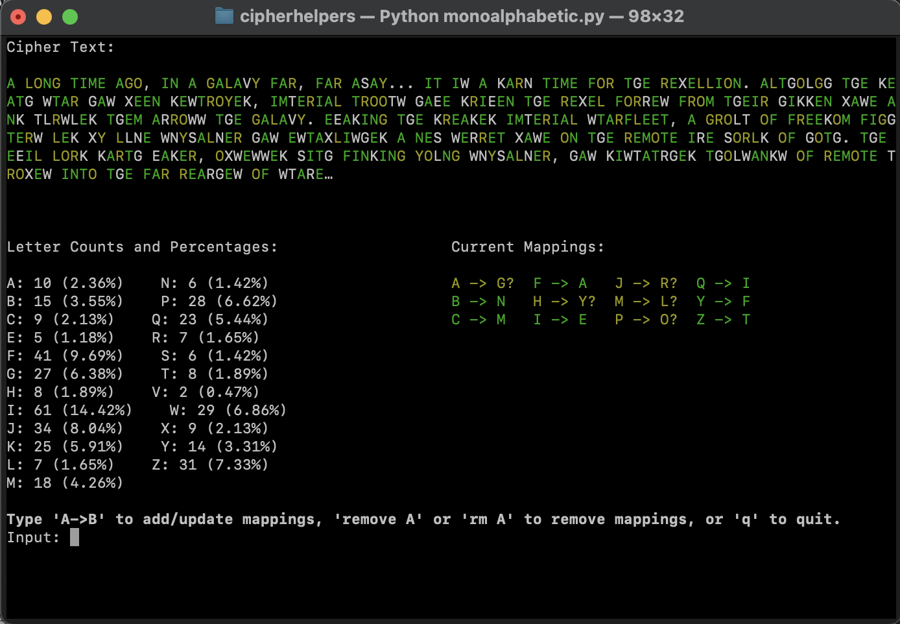
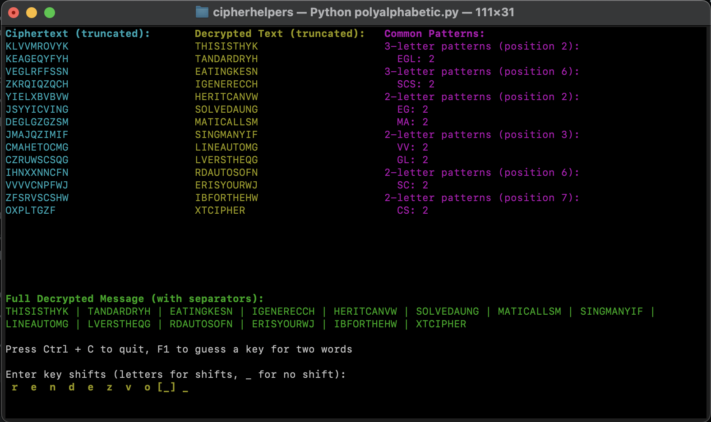

# CipherHelpers

Tools to aid with finding solutions to mono and polyalphabetic ciphers. Won't solve them for you, but saves paper.

Monoalphabetic Cipher Program Example

Polyalphabetic Cipher Example

## Installation

Just needs a valid Python 3 installation. Windows users may need to `pip install windows-curses`.

## Usage

Clone the repository with `git clone https://github.com/ConnRaus/CipherHelpers.git` and navigate to the directory in a terminal.

Run `python monoalphabetic.py` or `python polyalphabetic.py` to start the respective program and follow the instructions.
